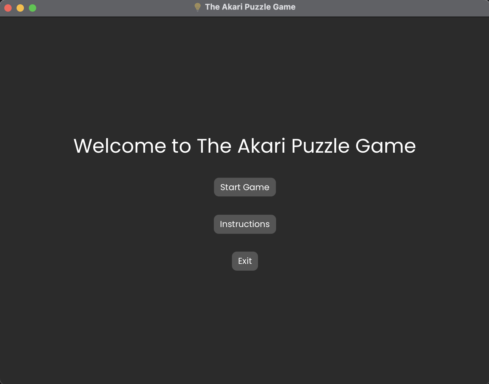
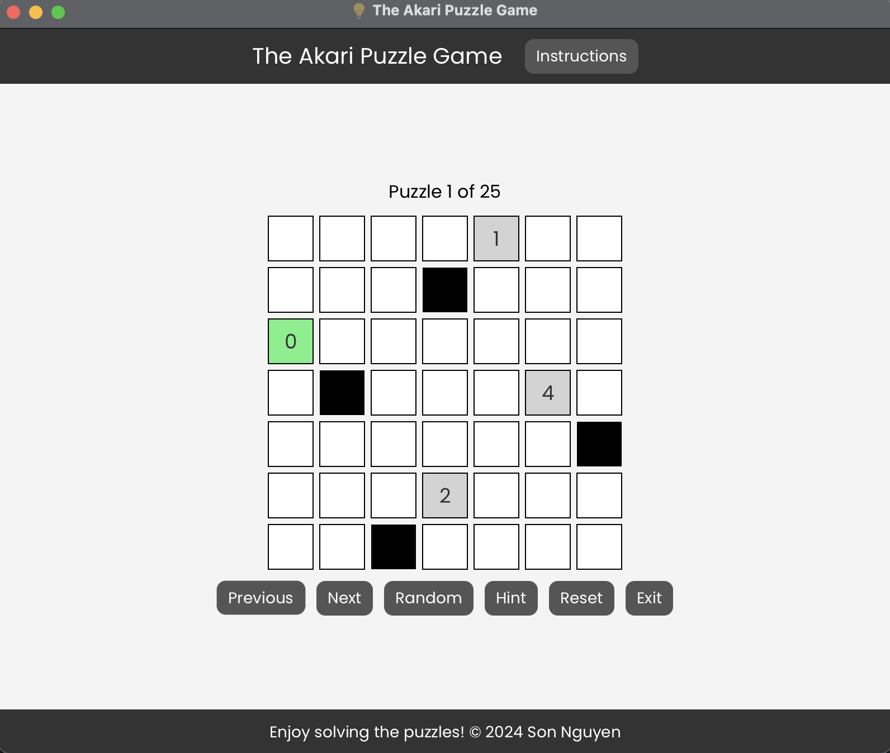
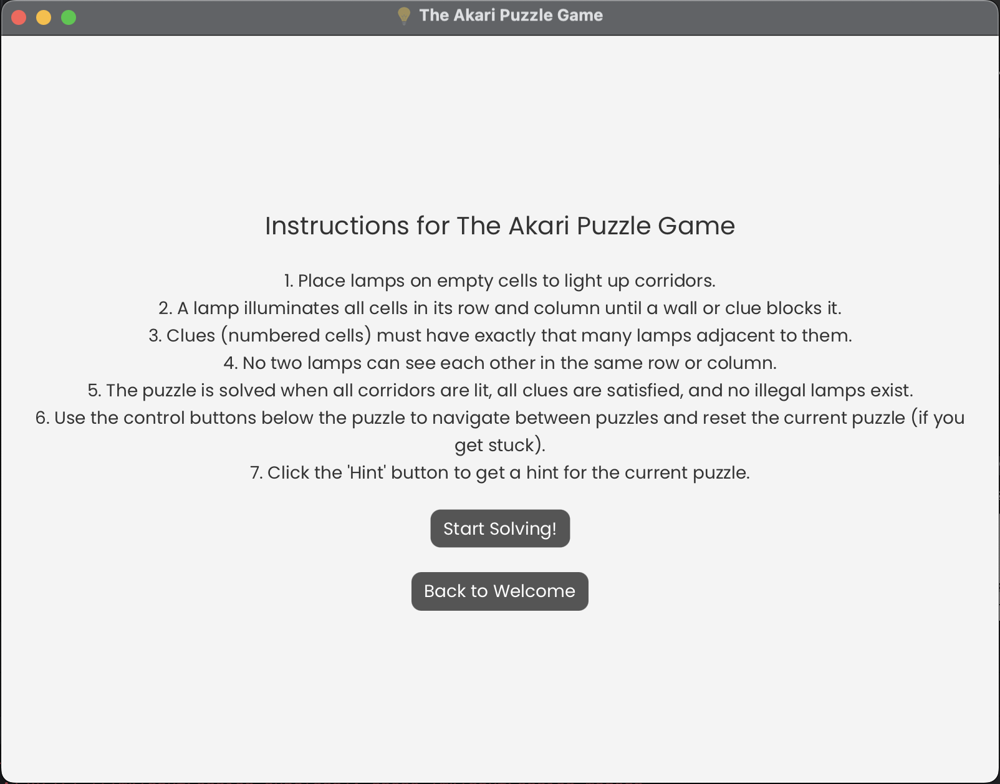
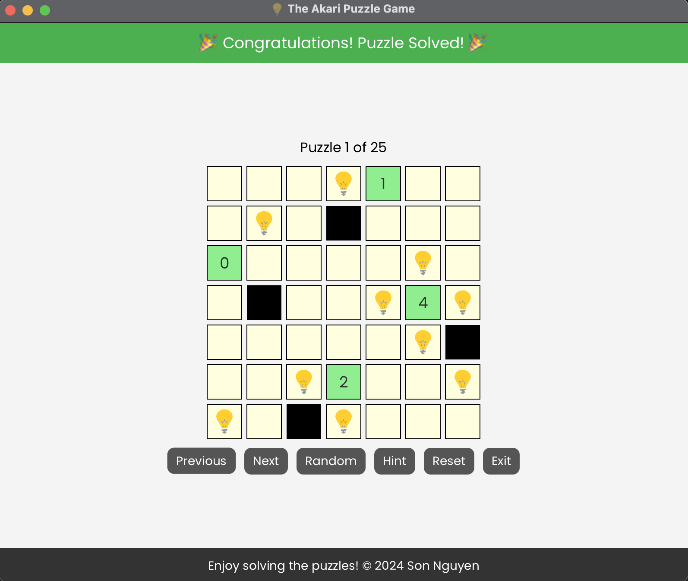
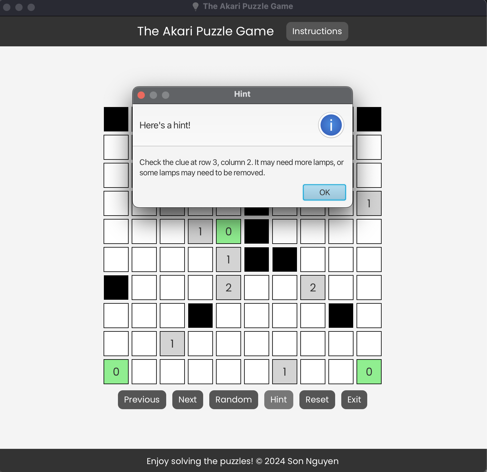

# The Akari Puzzle Game in JavaFX

Welcome to **The Akari Puzzle Game**, a JavaFX-based implementation of the classic logic puzzle "Akari" (also known as "Light Up"). This game challenges you to place lamps strategically on a grid to illuminate corridors while adhering to specific rules. With a sleek user interface and a collection of puzzles ranging in difficulty, this game offers hours of brain-teasing fun!

## Table of Contents

- [Overview](#overview)
- [User Interface](#user-interface)
- [Features](#features)
- [Game Rules](#game-rules)
- [Controls](#controls)
- [Scenes](#scenes)
- [How to Play](#how-to-play)
- [Puzzle Library](#puzzle-library)
- [Technical Details](#technical-details)
- [How to Run](#how-to-run)
- [Development](#development)
- [Credits](#credits)
- [License](#license)

## Overview

The Akari Puzzle Game is a single-player logic puzzle where the objective is to place lamps on a grid to light up all corridors without violating specific rules. The game features a variety of puzzles with different sizes and difficulties, providing a challenging and engaging experience for players. The user interface is designed to be intuitive and visually appealing, with interactive controls and dynamic feedback to guide players through the puzzles.

The game follows the **Model-View-Controller (MVC)** architecture, with separate classes for managing the game state, rendering the user interface, and handling user input. The game logic ensures that puzzles are solved correctly according to the rules of Akari, providing a satisfying experience for players of all skill levels.

## User Interface

### Welcome Screen

<p align="center">
  
</p>

### Game Screen

<p align="center">
  
</p>

### Instructions Screen

<p align="center">
  
</p>

### Puzzle Solved

<p align="center">
  
</p>

### Hints

<p align="center">
  
</p>

## Features

- **Intuitive Interface**: Navigate through puzzles with a user-friendly design.
- **Puzzle Library**: Includes a variety of puzzles ranging from easy to challenging.
- **Interactive Controls**: Navigate between puzzles, reset your progress, and get hints.
- **Dynamic Feedback**: Visual indicators for lit cells, clue satisfaction, and illegal lamps.
- **Game State Validation**: Ensures puzzles are solved correctly according to Akari rules.
- **Hints System**: Provides guidance to help you solve difficult puzzles.

## Game Rules

1. Place lamps on empty cells (`CORRIDOR`) to light up the entire grid.
2. A lamp illuminates all cells in its row and column until blocked by a wall or clue.
3. Clues (numbered cells) indicate the exact number of adjacent lamps.
4. No two lamps can illuminate each other (i.e., no two lamps can be in the same row or column unless separated by a wall).
5. The puzzle is solved when:
  - All corridors are lit.
  - All clues are satisfied.
  - No illegal lamps exist.

## Controls

### Buttons

- **Start Game**: Begin solving puzzles.
- **Instructions**: Learn the rules and mechanics of the game.
- **Exit**: Exit the application.
- **Next Puzzle**: Load the next puzzle in the library.
- **Previous Puzzle**: Return to the previous puzzle.
- **Random Puzzle**: Load a randomly selected puzzle.
- **Reset Puzzle**: Reset the current puzzle to its initial state.
- **Hint**: Get a hint to guide your progress.

### Mouse Interactions

- **Left-Click** on a `CORRIDOR` cell to place a lamp or remove an existing lamp.

## Scenes

### Welcome Scene

The first screen the user sees:
- Provides options to start the game, view instructions, or exit.
- Features a sleek design with a title and styled buttons.

### Game Scene

The main gameplay interface:
- Displays the puzzle grid, control buttons, and puzzle information.
- Highlights cells lit by lamps and provides real-time feedback on clue satisfaction.

### Instructions Scene

Provides detailed guidance on how to play:
- Explains the rules and controls.
- Accessible at any time during gameplay.

## How to Play

1. **Start the Game**: Launch the application and click "Start Game" on the welcome screen.
2. **Select a Puzzle**: Use the control buttons to navigate between puzzles. Use `Random Puzzle` to load a random challenge.
3. **Place Lamps**: Click on empty corridor cells to place lamps and illuminate the grid.
4. **Check Clues**: Ensure all clue cells are satisfied with the correct number of adjacent lamps.
5. **Solve the Puzzle**: Once all cells are lit, all clues are satisfied, and no illegal lamps exist, the puzzle is solved!
6. **Next Challenge**: Advance to the next puzzle or try a random one.
7. **Get Hints**: Use the hint button to receive guidance on difficult puzzles.
8. **Enjoy the Game**: Have fun solving puzzles and challenging your logical thinking!

## Puzzle Library

The game includes 25 preloaded puzzles ranging in size and difficulty. Each puzzle is carefully designed to challenge your logical thinking. More puzzles can be added via the `SamplePuzzles` class.

## Technical Details

### Architecture

- **Model-View-Controller (MVC)**: Ensures clean separation of concerns.
  - **Model**: Manages the state of the game, including the active puzzle and its properties.
  - **View**: Renders the user interface, including the puzzle grid and controls.
  - **Controller**: Handles user input and updates the model and view accordingly.

### Key Classes

- `AppLauncher`: The entry point of the application, manages scenes and stage.
- `ControllerImpl`: Implements the game logic and updates the model based on user input.
- `ModelImpl`: Represents the game state and validates puzzle conditions.
- `PuzzleView`, `ControlView`, `MessageView`: Render the puzzle grid, control buttons, and dynamic messages.
- `SamplePuzzles`: Contains preloaded puzzles for the game.
- `Main`: Contains the main method to launch the application.

### Key Interfaces

- `AlternateMvcController`: Defines the methods for handling user input and updating the game state.
- `ClassicMvcController`: Extends `AlternateMvcController` and adds methods for managing the game state.
- `Model`: Defines the methods for managing the game state and validating puzzle conditions.
- `Puzzle`: Represents a single puzzle with a grid, clues, and solution.
- `PuzzleLibrary`: Contains a collection of puzzles and methods for accessing them.
- `FXComponent`: Represents a JavaFX component with methods for initializing and updating the view.

### Dependencies

- **Java 17+**: Core programming language for the application.
- **JavaFX**: Used for the user interface and event handling.
- **JUnit 4**: For unit testing the model and controller logic.
- **Mockito**: For mocking dependencies during testing.

## How to Run

### Prerequisites

- Java Development Kit (JDK) version 17 or later.
- Maven for dependency management (optional).

### Steps
1. Clone the repository:
   ```bash
   git clone https://github.com/hoangsonww/Akari-Puzzle-Game-JavaFX.git
   ```
2. Navigate to the project directory:
   ```bash
   cd Akari-Puzzle-Game-JavaFX
   ```
3. Build and run the project:
   ```bash
   mvn javafx:run
   ```
   Alternatively, you can run the `AppLauncher` class directly from your IDE, if you are using IDEs like IntelliJ IDEA or Eclipse and have JavaFX configured.

## Development

### Adding New Puzzles

1. Open the `SamplePuzzles` class.
2. Add a new 2D integer array representing the puzzle grid.
3. Register the new puzzle in the `PuzzleLibrary` within `AppLauncher`.

### Styling

- Modify the `main.css` file to customize the appearance of the application.
- Use of CSS styles to change colors, fonts, and layout properties.

### Unit Testing
- Run the JUnit 4 test suite to validate the functionality:
  ```bash
  mvn test
  ```
- Test cases cover model logic, controller actions, and game state validation.
- Alternative: Run individual test classes directly from your IDE.

## Credits

- **Developer**: [Son Nguyen](https://github.com/hoangsonww)
- **Icon**: [Freepik](https://www.flaticon.com/authors/freepik) via Flaticon.
- **Puzzle Design**: Inspired by the classic logic puzzle "Akari" (Light Up).

## License

This project is licensed under the MIT License. See the `LICENSE` file for details.

---

Created with ❤️ by [Son Nguyen](https://github.com/hoangsonww) in 2024.
